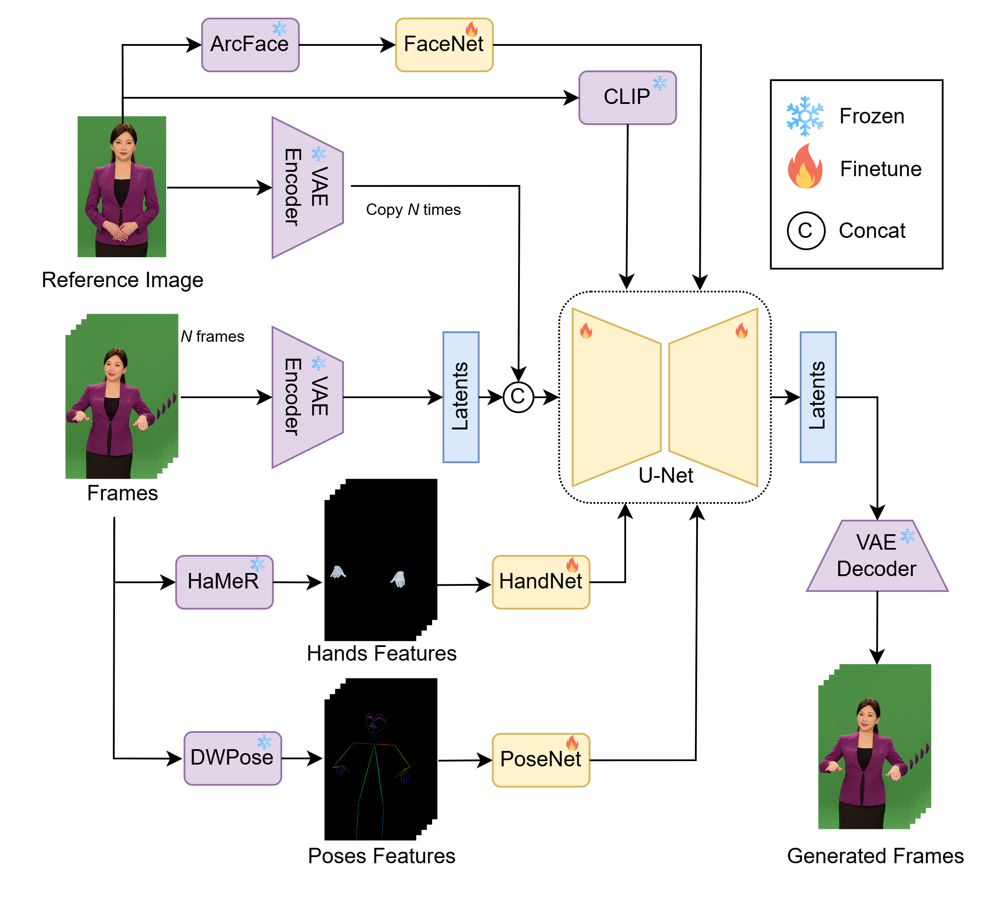

# Optimal Control Diffusion for Human Motion Transfer

## Create a virtual environment
create a conda enviroment 
```
    conda env create -f environment.yaml
```

activate the environment
```
    conda activate optimal-control-diffusion
```

## How to run
```
    bash ./command_optimal_control_infer.sh
```
output will be saved in `inference/optimal_control_results/`